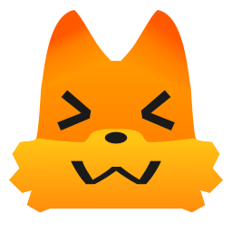
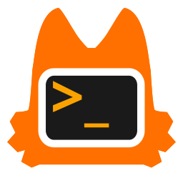

# Geometric Orange Fox Terminal Icon

Main

Alt
- These are original geometric fox terminal icons, drawn from scratch. They are inspired from Kit, Firefox's mascot.
- The main one can also work as an app launcher icon.
- These are unofficial fan-made artworks. It is not affiliated with, sponsored by, or endorsed by Mozilla.

# License

My original contributions to this artwork are licensed under the Creative Commons Attribution 4.0 International License (CC BY 4.0).
Firefox, Mozilla, and Kit are trademarks and/or intellectual property of their respective owners. This license does not grant rights to Mozilla's trademarks or other material owned by Mozilla.
